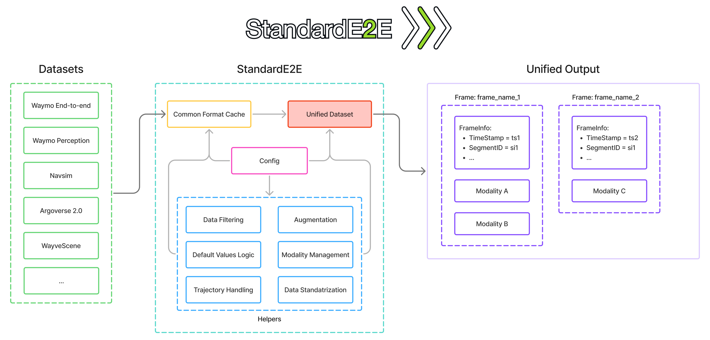

StandardE2E Documentation
=========================

**A framework for unified end-to-end autonomous driving datasets processing**

StandardE2E provides a consistent interface for preprocessing, loading, and training with multimodal data from various end-to-end autonomous driving datasets. It standardizes the complex process of working with different dataset formats, allowing researchers to focus on model development rather than data engineering.

|

Key Features
------------

✨ **Unified Data Format and API** - Single representation and consistent interface for all datasets

🔄 **Multimodal Support** - Camera, LiDAR, HD maps, trajectories, detections, driving command, etc

⚙️ **Parametrizable Pipelines** - Configure programmatically or via YAML files

🚀 **PyTorch Native** - Seamless DataLoader integration

📦 **Extensible** - Add new datasets, adapters, augmentations, etc.

Getting Started
---------------

Install from PyPI:

.. code-block:: bash

   pip install standard-e2e

Or for development:

.. code-block:: bash

   git clone https://github.com/stepankonev/StandardE2E.git
   cd StandardE2E
   uv sync --all-extras

Refer to the :doc:`quickstart` guide for detailed usage.

Documentation
-------------

.. toctree::
   :maxdepth: 2
   :caption: Getting Started

   quickstart
   overview
   datasets
   preprocessing_performance

.. toctree::
   :maxdepth: 2
   :caption: API Reference

   reference/api

.. toctree::
   :maxdepth: 1
   :caption: Tutorials

   📓 Introduction Tutorial <https://github.com/stepankonev/StandardE2E/blob/main/notebooks/intro_tutorial.ipynb>
   📓 Data Containers <https://github.com/stepankonev/StandardE2E/blob/main/notebooks/containers.ipynb>
   📓 Multi-Dataset Training <https://github.com/stepankonev/StandardE2E/blob/main/notebooks/multi_dataset_training_and_filtering.ipynb>
   📓 Custom Adapters <https://github.com/stepankonev/StandardE2E/blob/main/notebooks/creating_custom_adapter.ipynb>

.. toctree::
   :caption: Project Links
   :hidden:

   GitHub <https://github.com/stepankonev/StandardE2E>
   Discord <https://discord.gg/vJnQNcQGQ8>
   PyPI <https://pypi.org/project/standard-e2e/>

Community & Support
-------------------

Reach out to the maintainers via GitHub issues or Discord.

- **GitHub Issues**: https://github.com/stepankonev/StandardE2E/issues
- **Discord**: https://discord.gg/vJnQNcQGQ8

Indices and tables
==================

* :ref:`genindex`
* :ref:`modindex`
* :ref:`search`
