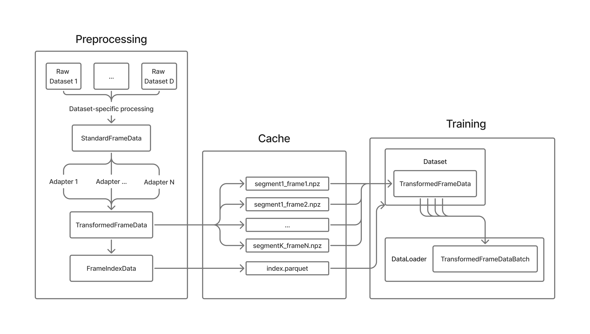

Overview
========

StandardE2E is a unified framework for preprocessing, indexing, and loading autonomous driving datasets. It enables training models on multiple heterogeneous datasets with a single, consistent API.

Why StandardE2E?
----------------

Training autonomous driving models on diverse datasets is challenging:

- **Different data formats**: Each dataset has unique file structures and APIs
- **Inconsistent modalities**: Camera formats, LiDAR representations, and annotation styles vary
- **Complex preprocessing**: Converting raw data to model-ready format requires dataset-specific code
- **Limited flexibility**: Switching or combining datasets means rewriting data pipelines

StandardE2E solves these problems by providing:

🎯 **One Format to Rule Them All**
   All datasets are converted to a unified :class:`~standard_e2e.data_structures.frame_data.TransformedFrameData` representation with consistent modality keys and metadata.

⚡ **Efficient Indexing**
   Parquet-based indexes enable fast filtering, sampling, and frame lookup without loading raw data.

🔌 **Extensible by Adding New Datasets**
   Once processed, new datasets follow the same API and provide consistent data structures. No changes to training code required.

🎨 **Flexible Augmentation**
   Chain frame-level augmentations that work across all datasets. Regime-aware (train/val/test).

🔧 **Parametrizable Pipelines**
   Configure what to load programmatically or via YAML config files. Same config works across all supported datasets.

Architecture
------------

|

The framework consists of three main stages:

1. **Preprocessing - Raw Data to Unified Format**
   
   Converts dataset-specific formats into a standardized representation with efficient indexing.

   - **Dataset Processor**: Implements dataset-specific logic to read raw data and convert it to :class:`~standard_e2e.data_structures.frame_data.StandardFrameData` (a generic, unified representation)
   - **Adapters**: Transform :class:`~standard_e2e.data_structures.frame_data.StandardFrameData` into :class:`~standard_e2e.data_structures.frame_data.TransformedFrameData` with user-defined processing (e.g., image resizing, pano projection, normalization). Adapters are reusable across datasets (:class:`~standard_e2e.caching.adapters.abstract_adapter.AbstractAdapter` base)
   - **Index Generation**: Creates a Parquet-based index enabling fast filtering, sampling, and frame lookup without loading the actual data
   - **Output**: Individual `.npz` files per frame containing all modalities, plus an `index.parquet` file with metadata

   Preprocessing can be done via CLI or programmatically, configured through YAML or Python code.

2. **Dataset Creation - Configurable Loading**
   
   Creates PyTorch-compatible datasets from preprocessed data.

   - **Feature/Label Configuration**: Specify which frames and modalities to load through ``feature_loaders_config`` and ``label_loaders_config``
   - **Frame Selectors**: Define temporal relationships (e.g., load current frame, frame 1 second in future, or closest past frame) via :class:`~standard_e2e.dataset_utils.selector.FrameSelector` implementations such as :class:`~standard_e2e.dataset_utils.selector.current_selector.CurrentSelector` and :class:`~standard_e2e.dataset_utils.selector.closest_timestamp_selector.ClosestTimestampSelector`
   - **Modality Defaults**: Provide fallback values for missing modalities (e.g., when a dataset lacks certain sensors) via :class:`~standard_e2e.dataset_utils.modality_defaults.modality_defaults.ModalityDefaults` implementations
   - **Augmentations**: Apply regime-aware transformations (different for train/val/test) using :class:`~standard_e2e.dataset_utils.augmentation.augmentation.FrameAugmentation` derivatives
   - **Index Filters**: Apply runtime filtering (e.g., only daytime scenes, only frames with certain labels) with :class:`~standard_e2e.indexing.filters.index_filter.IndexFilter` subclasses

3. **DataLoader Integration - Batching for Training**
   
   Seamlessly integrates with PyTorch training loops.

   - **Custom Collation**: Handles variable-length sequences and nested data structures
   - **Efficient Loading**: Leverages multiprocessing and lazy loading
   - **Batch Structure**: Returns dict of frame names → ``TransformedFrameData`` objects

Key Concepts
------------

Two-Stage Data Representation
~~~~~~~~~~~~~~~~~~~~~~~~~~~~~~

StandardE2E uses two data structures during preprocessing:

**StandardFrameData** - Generic unified format
   Raw dataset → :class:`~standard_e2e.data_structures.frame_data.StandardFrameData`
   
   Created by dataset-specific processors. Contains data in a generic unified format without any user-specific transformations. For example, camera data includes original images with intrinsics/extrinsics matrices.

**TransformedFrameData** - Processing-ready format
   :class:`~standard_e2e.data_structures.frame_data.StandardFrameData` → :class:`~standard_e2e.caching.adapters.abstract_adapter.AbstractAdapter` → :class:`~standard_e2e.data_structures.frame_data.TransformedFrameData`
   
   The final format used during training. Adapters apply user-defined transformations (image resizing, panorama projection, normalization, etc.). Each sample contains:

   - **Modality data**: cameras, lidar_pc, hd_map, detections_3d, future_states, past_states, intent, preference_trajectory
   - **Metadata**: timestamps, scene IDs, segment context, dataset identifiers

   This separation allows:
   - Dataset-specific logic to be written once (processor)
   - Reusable transformations across datasets (adapters)
   - Users to customize preprocessing without modifying dataset readers

Adapters
~~~~~~~~

Adapters transform :class:`~standard_e2e.data_structures.frame_data.StandardFrameData` into :class:`~standard_e2e.data_structures.frame_data.TransformedFrameData`. Key adapter types:

- **Camera Adapters**: Image transformations (pano projection, resizing, compression) such as :class:`~standard_e2e.caching.adapters.pano_adapter.PanoImageAdapter`
- **Trajectory Adapters**: Temporal sequence processing, coordinate transformations
- **Identity Adapters**: Pass-through for modalities that don't need transformation (e.g., :class:`~standard_e2e.caching.adapters.identity_adapters.FutureStatesIdentityAdapter`)

Adapters are:
- **Reusable**: Same adapter works across different datasets
- **Configurable**: Parameters set via YAML or code
- **Extensible**: Easy to create custom adapters for specific use cases

Frame Selectors
~~~~~~~~~~~~~~~

Selectors determine which frame to fetch relative to the current index row:

- ``current``: The indexed frame itself (:class:`~standard_e2e.dataset_utils.selector.current_selector.CurrentSelector`)
- ``closest_timestamp``: Frame with closest timestamp to target time (:class:`~standard_e2e.dataset_utils.selector.closest_timestamp_selector.ClosestTimestampSelector`)

  - Specify ``delta_t`` parameter for time offset (negative for past, positive for future)
  - Example: ``delta_t: 1.0`` for 1 second in the future

Example Use Cases
-----------------

Multi-Dataset Training
~~~~~~~~~~~~~~~~~~~~~~

Train a planning model on both Waymo and Argoverse:

.. code-block:: python

   from standard_e2e.indexing import get_multi_dataset_index
   
   # Load indexes from both datasets
   waymo_idx = pd.read_parquet("/data/waymo/index.parquet")
   argo_idx = pd.read_parquet("/data/argoverse/index.parquet")
   
   # Combine using utility function
   combined_idx = get_multi_dataset_index([waymo_idx, argo_idx])
   
   # Create dataset - same config works for both!
   dataset = UnifiedE2EDataset(
       index_data=combined_idx,
       processed_data_path="/data",
       feature_loaders_config=config["dataset"]["features"],
       label_loaders_config=config["dataset"]["labels"],
       regime="train",
   )

Cross-Dataset Evaluation
~~~~~~~~~~~~~~~~~~~~~~~~~

Train on Waymo, evaluate on Argoverse to test generalization:

.. code-block:: python

   # Training
   train_dataset = UnifiedE2EDataset(waymo_train_idx, regime="train", ...)
   
   # Evaluation on different dataset
   val_dataset = UnifiedE2EDataset(argo_val_idx, regime="val", ...)

Data Ablation Studies
~~~~~~~~~~~~~~~~~~~~~

Easily filter and sample data for ablation studies:

.. code-block:: python

   # Filter to daytime, urban scenes only
   filtered_idx = index[
       (index['time_of_day'] == 'day') & 
       (index['scene_type'] == 'urban')
   ]

Next Steps
----------

- 🚀 Start with the :doc:`quickstart` guide
- 📖 Read the :doc:`user_guide` for detailed usage
- 🔍 Explore the :doc:`reference/api` for complete API docs
- 📓 Try the `interactive notebooks <https://github.com/stepankonev/StandardE2E/tree/main/notebooks>`_
